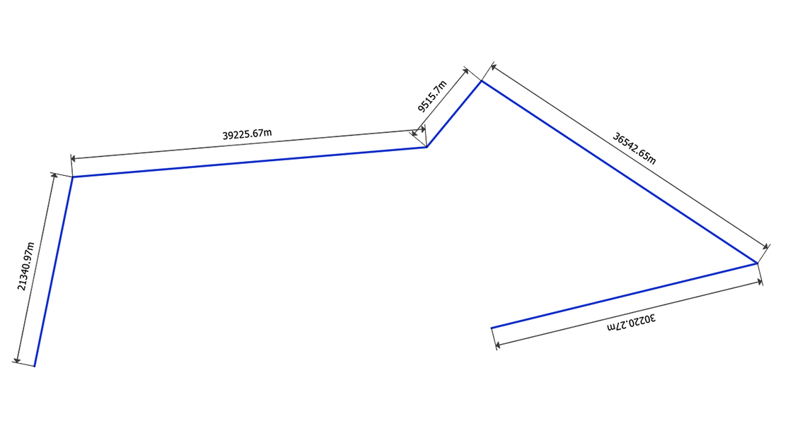
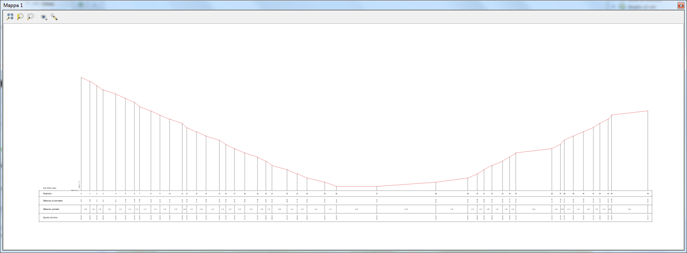

# Faunalia Sharing Resources

This repository contains styles, scripts, models and other QGIS 
resources that can be shared with the QGIS Resources Sharing.

## Collections

[**Distance Measurements**](https://github.com/faunalia/QGIS-Resources/tree/master/collections/distance-measurements): automatically measure line length or polygon perimeter
and area with style!

[**Profiles**](https://github.com/faunalia/QGIS-Resources/tree/master/collections/profiles): collection of Processing Scripts and style to generate profiles
on the Map Canvas. Special thanks to @Korto19

