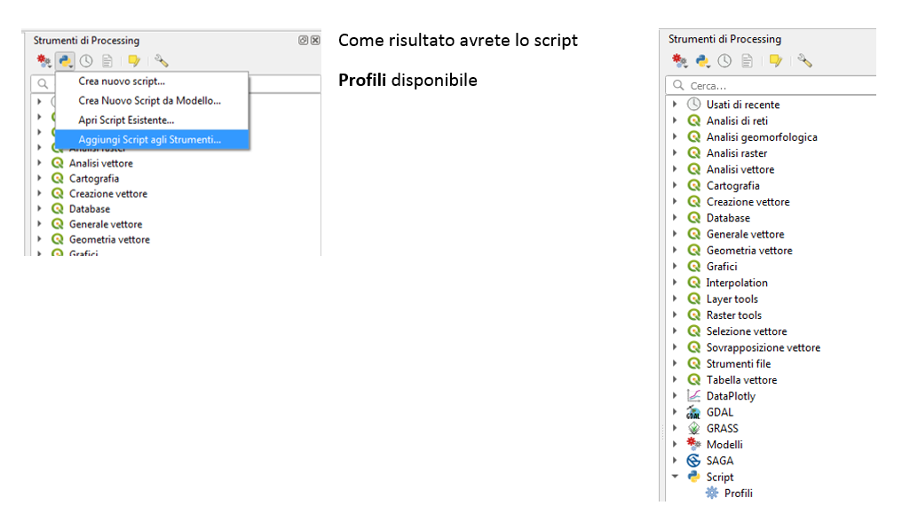
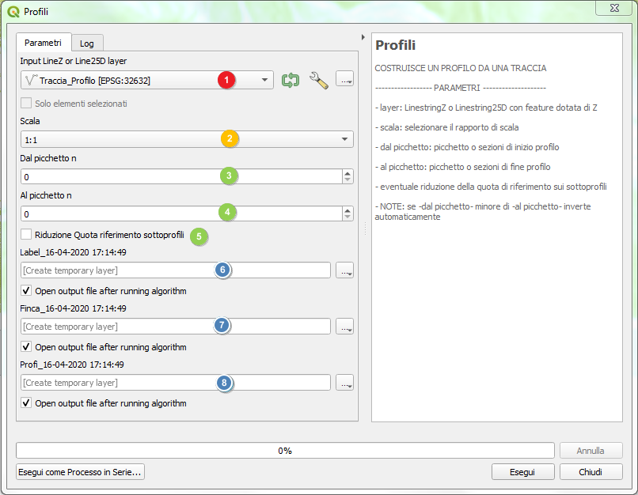
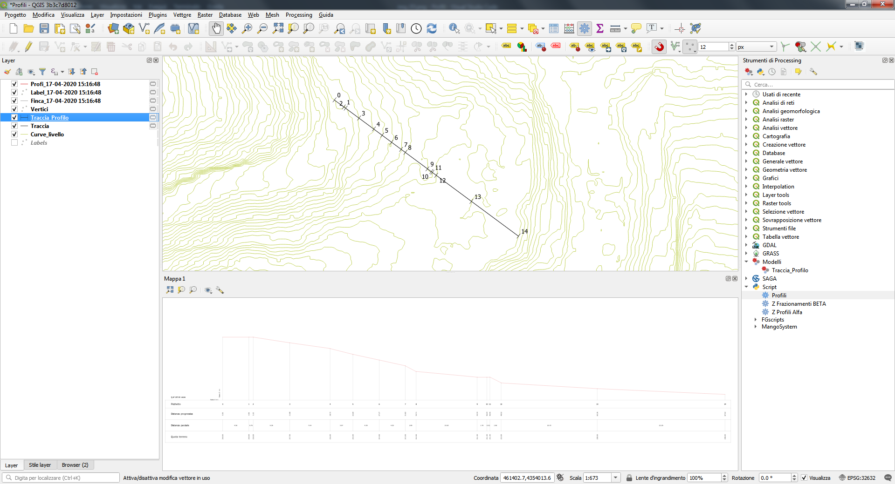
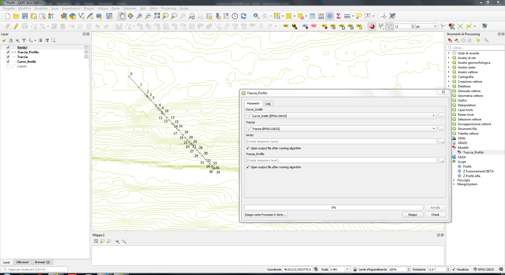
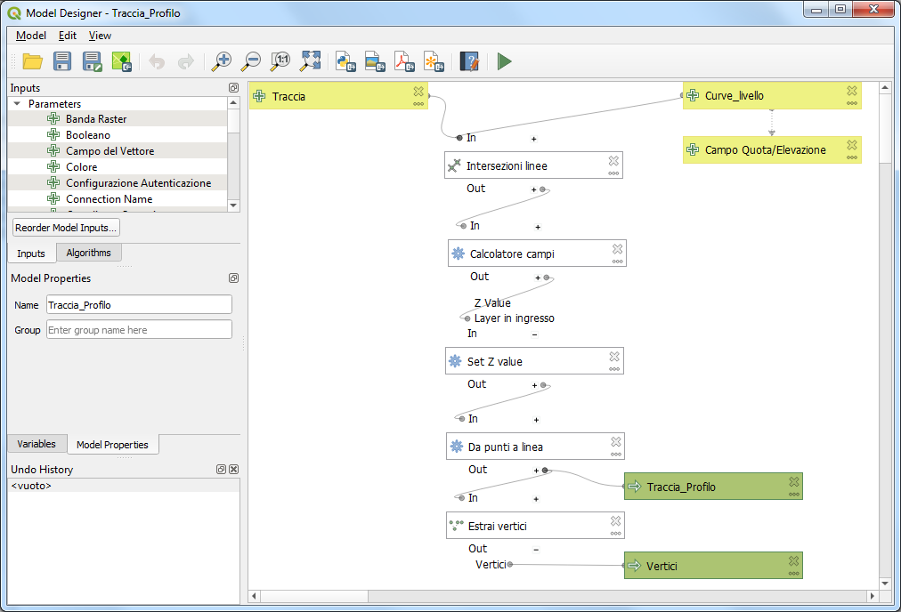

# Profilis

## PROCESSING PER REDAZIONE PROFILI

Una tipica attività cartografica consiste nel realizzare profili del terreno, l'algoritmo di processing **_PROFILI_** permette di ottenere rapidamente un profilo da una traccia che sia una LinestringZ o una Linestring25D

## Caricamento algoritmo di processing
	
Da **Strumenti di Processing** eseguire **Aggiungi Script agli Strumenti**

## Finestra dell’algoritmo

Descrizione parametri:

1. [**richiesto**] layer LinestringZ o Linestring25D su cui giace la traccia
2. [**opzione**] scala di disegno normalmente 1:1 (si scala in stampa) [disponibili 1:1, 1:10, 1:2, 1:20]
3. [**opzione**] Picchetto o sezione di partenza del profilo
4. [**opzione**] Picchetto o sezione di arrivo del profilo
   NOTA: i valori si desumono del profilo una volta eseguito, il primo valore deve essere minore del seconto, eventuale svista di inserimento viene corretta automaticamente dal programma scambiando i valori  
5. [**opzionale**] In caso di subprofilo è possibile ridurre automaticamente la    nuova quota di riferimento
6. [**opzionale**] Layer puntuale di risultato per le etichette
7. [**opzionale**] Layer line di risultato delle candele e delle fincature
8. [**opzionale**] Layer line di risultato della traccia del profilo
   
## Modalità operative
Una volta caricato il layer della tracce selezionandone una è possibile ottenerne il profilo, se ve ne son presenti più di una verranno disegnate anche le altre.
Per scelta il profilo viene disegnato sul canvas a partire dall'origine (0,0), soltanto i subprofili (parti di profilo da sezione xx a sezione yy) vengono disegnati nella posizione a cui corrisponde la progressiva.

Per ottenere il profilo come visualizzato occorre tematizzare opportunamente il layer delle label con il file **Etichette.qml**, il layer della fincatura con **Fincatura.qml** ed il layer del terreno con **Profilo.qml**, questi tematismi possono essere automaticamente applicati se specificati in fase di rendering del processing [_purtroppo quello delle etichette non viene applicato per via di un bug_]

## AVVERTENZE
Solo linestring 3D vengono riconosciute dall'algoritmo

## Clip dimostrativa

https://youtu.be/0izfW0zont4

## Esempio di Profilo

https://github.com/Korto19/Profili/blob/master/Profili.py

## APPENDICE
Per poter estrarre tracce 3d da piani a curve di livello si è realizzato, con il modellatore grafico, un processo che date le curve di livello, il campo in cui è memorizzata la quota/elevazione delle curve e linea di traccia produce in un solo passaggio la traccia del profilo in 3D evidenziandone i vertici con il ripettivo numero progressivo (applica in fase di rendering i due tematismi **Traccia_profilo.qml** e **Vertici.qml**)

per funzionare occorre che il layer si chiami obbligatoriamente **Traccia**, da questo produrrà un nuovo layer **Traccia_profilo** da passare all'algoritmo **Profili** ed il layer **Vertici** utile a tematizzare convenientemente la traccia.

https://github.com/Korto19/Profili/blob/master/Traccia_profilo.model3